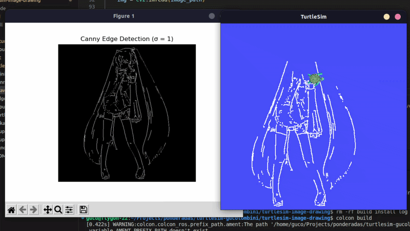
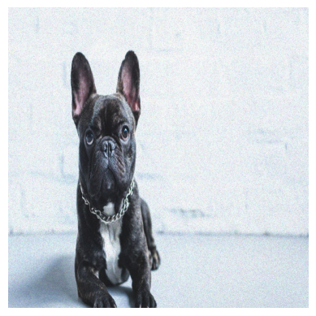
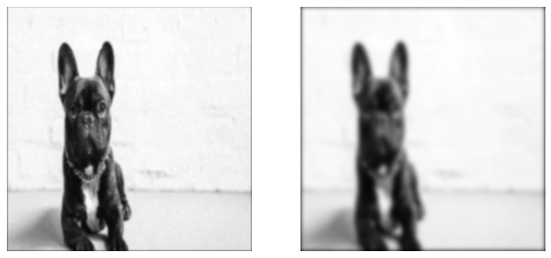
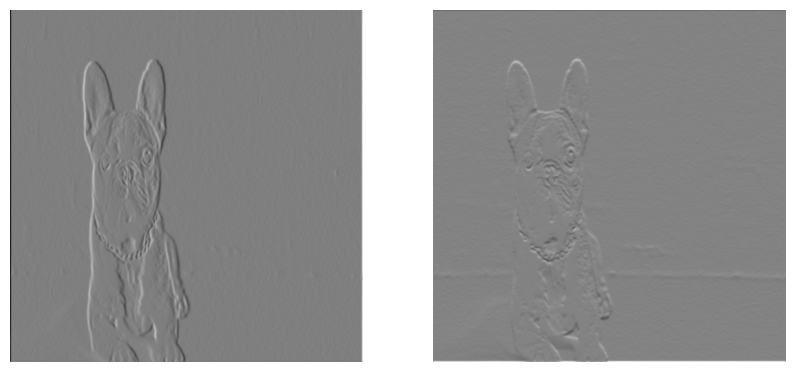
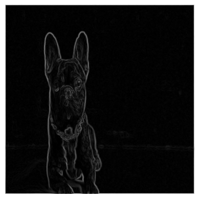
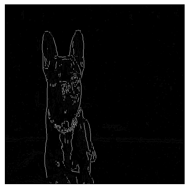
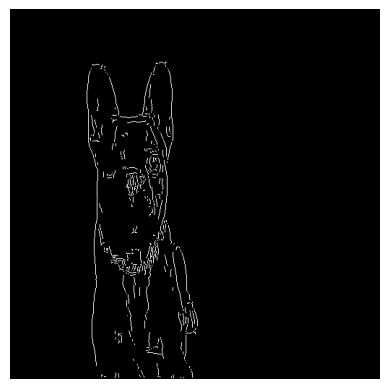

# TurtleSim Image Drawing

Uma aplicação que é capaz de importar qualquer imagem que o usuário desejar e comandar de forma autônoma o TurtleSim para fazer o desenho do contorno da imagem. Isso é realizado por meio da pipeline Canny de detecção de bordas, com todas as transformações da imagem sendo realizadas por manipulação direta das matrizes por meio da biblioteca Numpy, sem uso de funções já existentes do OpenCV.



*GIF de demonstração da aplicação, desenhando uma imagem da Hatsune Miku*

## [Vídeo de demonstração básica](https://drive.google.com/file/d/1wbNXbA-2_1UmZSjmlqh7RT_y6LZbaexj/view?usp=sharing)

# Instruções de Execução

## Requisitos:

- Ubuntu (debatível)
- ROS2 com TurtleSim
- Python3 + rosdep + colcon

**Esse projeto usa sua instalação padrão de Python**; se houver problemas com dependências, tente usar uma versão mais recente. *(aka eu não sei configurar um ambiente virtual pra pacotes ROS2)*

Antes de tudo, dê source na sua instalação favorita de ROS2 (troque "humble" pelo nome correspondente):
```bash
source /opt/ros/humble/setup.bash
```

Clone esse repositório em seu dispositivo. Na raiz do repositório, execute:
```bash
rosdep install --from-paths src --ignore-src -r -y
```

Se todas as dependências forem instaladas com sucesso, execute o seguinte comando para buildar o pacote:
```bash
colcon build
```

Após o processo finalizar com sucesso, inicie o TurtleSim em outro terminal e execute o seguinte comando para iniciar o processo de desenho da imagem (Uma conexão estável é necessária para garantir a execução do programa sem erros!):

```bash
source install/setup.bash
ros2 run turtle-artist draw_image
```

A aplicação abrirá uma interface para que selecione uma imagem do seu computador para ser desenhada. Se não selecionar nenhuma, uma imagem padrão (o cachorro) será utilizada.

# Documentação

## Detecção de bordas (Canny)

Foi selecionado o método de detecção de bordas Canny por sua capacidade de traçar as bordas da maioria das imagens, mesmo com variações de luminosidade, contraste ou ruído. Isso é realizado através da manipulação da imagem em 5 etapas:



*Imagem original*

### 1. Desfoque Gaussiano

A imagem (transformada em sua versão monocromática, uma vez que informação de cor não é utilizada nesse processo) passa por um filtro de desfoque gaussiano para evitar que detalhes de ruído ou outros artefatos sejam detectados como bordas. Esse filtro pode ser ajustado através da variável Sigma, afetando quanto desfoque a imagem sofrerá.

```python
def gaussian_kernel(size=5, sigma=1.0):
    ax = np.arange(-size // 2 + 1, size // 2 + 1)
    xx, yy = np.meshgrid(ax, ax)

    kernel = np.exp(-(xx**2 + yy**2) / (2 * sigma**2))
    kernel = kernel / np.sum(kernel)
    
    return kernel

def gaussian_blur(img, sigma=1.0):
    size = 6 * sigma + 1
    if size % 2 == 0:
        size += 1

    kernel = gaussian_kernel(size, sigma)
    return convolve(img, kernel)
```



*Imagem após desfoque gaussiano (σ = 2) e (σ = 5), respectivamente*

### 2. Filtro de Sobel
Com a imagem desfocada, agora queremos encontrar onde ocorrem as variações de valores dos pixels, pois é aí que se encontram as bordas. O Filtro de Sobel usa dois kernels para calcular a variação horizontal e vertical dos pixels, e traz uma aproximação do gradiente de intensidade dos pixels, retornando a direção e magnitude desse gradiente. 

```python
def sobel(img):
    kernel_sobel_x = np.array([
        [-1, 0, 1],
        [-2, 0, 2],
        [-1, 0, 1]
    ])

    kernel_sobel_y = np.array([
        [-1, -2, -1],
        [0, 0, 0],
        [1, 2, 1]
    ])

    gx = convolve(img, kernel_sobel_x)
    gy = convolve(img, kernel_sobel_y)

    magnitude = np.hypot(gx, gy)
    magnitude = magnitude / magnitude.max() * 255
    theta = np.arctan2(gy, gx)

    return magnitude, theta
```



*Resultados da convolução da imagem com os kernels de Sobel*



*Imagem resultante do cálculo da magnitude dos pixels*

### 3. Supressão de Não-Máximos

O gradiente traz já uma aproximação das bordas, mas queremos que as bordas tenham apenas 1 pixel de grossura, então devemos encontrar os pixels mais fortes de cada curva do contorno e manter eles, eliminando o resto. 

```python
def non_max_suppression(img, theta):
    img_w, img_h = img.shape
    output = np.zeros((img_w,img_h))
    angle = theta * 180. / np.pi
    angle[angle < 0] += 180
    
    for i in range(1,img_w-1):
        for j in range(1,img_h-1):
            try:
                q = 255
                r = 255
                
               # 0*
                if (0 <= angle[i,j] < 22.5) or (157.5 <= angle[i,j] <= 180):
                    q = img[i, j+1]
                    r = img[i, j-1]
                # 45*
                elif (22.5 <= angle[i,j] < 67.5):
                    q = img[i+1, j-1]
                    r = img[i-1, j+1]
                # 90*
                elif (67.5 <= angle[i,j] < 112.5):
                    q = img[i+1, j]
                    r = img[i-1, j]
                # 135*
                elif (112.5 <= angle[i,j] < 157.5):
                    q = img[i-1, j-1]
                    r = img[i+1, j+1]

                if (img[i,j] >= q) and (img[i,j] >= r):
                    output[i,j] = img[i,j]
                else:
                    output[i,j] = 0

            except IndexError as e:
                pass
    
    return output
```


*Imagem após a supressão de não-máximos*

### 4. Limiarização Dupla

Com o contorno geral da imagem já encontrado, vamos separar os pixels fortes dos fracos, para podermos remover o contorno de detalhes sutís e de elementos não relevantes. A limiarização dupla é provavelmente a etapa mais simples do processo, apenas determinando os valores de separação entre a força dos pixels e categorizando cada um deles. A imagem resultante tem apenas três cores: 0 (preto), cor fraca e cor forte ().

```python
def threshold(img, lowThresholdRatio=0.2, highThresholdRatio=0.3):
    
    highThreshold = img.max() * highThresholdRatio
    lowThreshold = highThreshold * lowThresholdRatio
    
    img_w, img_h = img.shape
    res = np.zeros((img_w, img_h))
    
    weak = np.int32(25)
    strong = np.int32(255)
    
    strong_i, strong_j = np.where(img >= highThreshold)
    weak_i, weak_j = np.where((img <= highThreshold) & (img >= lowThreshold))
    
    res[strong_i, strong_j] = strong
    res[weak_i, weak_j] = weak
    
    return (res, weak, strong)
```



*Imagem após a limiarização dupla (note os pixels fracos ainda presentes na imagem)*

### 5. Histerese

Com as bordas fracas e fortes separadas, agora vamos apenas manter as bordas fortes. Antes de remover todos os pixels fracos, fazemos uma verificação para ver quais bordas fracas conectam com bordas fortes, fechando contornos. Daí, eliminamos todo o resto.

```python
def hysteresis(img, weak, strong=255):
    M, N = img.shape  
    for i in range(1, M-1):
        for j in range(1, N-1):
            if (img[i,j] == weak):
                try:
                    if ((img[i+1, j-1] == strong) or (img[i+1, j] == strong) or (img[i+1, j+1] == strong)
                        or (img[i, j-1] == strong) or (img[i, j+1] == strong)
                        or (img[i-1, j-1] == strong) or (img[i-1, j] == strong) or (img[i-1, j+1] == strong)):
                        img[i, j] = strong
                    else:
                        img[i, j] = 0
                except IndexError as e:
                    pass
    return img
```



*Imagem após histerese, resultado final da pipeline com σ = 2*

## Planejamento de caminho

Com a imagem processada, agora devemos planejar o caminho que a tartaruga irá percorrer. Podemos usar uma função simples onde a tartaruga percorre cada pixel branco da imagem sem ordem específica, mas isso é lento e usualmente resulta em um desenho desconectado e ruim. O ideal é percorrer apenas o contorno da imagem, e fazemos isso extraindo as curvas da imagem.

Criamos uma matriz vazia de mesmo tamanho da imagem, marcando quais pixeis já foram checados ou não. Daí, olhamos para cada pixel branco e vemos se tem algum vizinho branco também, então fazemos a mesma coisa com esse pixel vizinho, e repetimos isso até não termos mais vizinhos, guardando esses pixels visitados como uma curva. Fazendo isso para todos os pixels, obtemos uma lista de todas as curvas, que são por sua vez listas de posições vizinhas que se conectam.

Daí, apenas fazemos a tartaruga percorrer o percurso de cada uma dessas curvas, traçando o desenho completo linha por linha.

```python
def neighbors(x, y, img):
    h, w = img.shape
    for dx in [-1, 0, 1]:
        for dy in [-1, 0, 1]:
            if dx == 0 and dy == 0:
                continue

            nx, ny = x + dx, y + dy
            if 0 <= nx < h and 0 <= ny < w:
                if img[nx, ny]:
                    yield nx, ny

def trace_curve(img, visited, start):
    curve = []
    stack = [start]

    while stack:
        x, y = stack.pop()

        if visited[x, y]:
            continue

        visited[x, y] = True
        curve.append((x, y))

        next_pixels = [n for n in neighbors(x, y, img) if not visited[n]]

        if next_pixels:
            stack.append(next_pixels[0])

    return curve

def extract_curves(img_edges):
    visited = np.zeros_like(img_edges, dtype=bool)
    curves = []

    h, w = img_edges.shape

    for x in range(h):
        for y in range(w):
            if img_edges[x, y] and not visited[x, y]:
                curve = trace_curve(img_edges, visited, (x, y))
                if len(curve) > 1:
                    curves.append(curve)

    return curves

def to_world(x, y, shape):
    h, w = shape
    wx = (y / w) * 10
    wy = (x / h) * 10
    return wx, wy

curves = extract_curves(img_edges)

turtle.pen_up()
turtle.clear()

for curve in curves:

    if len(curve) < 2:
        continue

    x0, y0 = curve[0]
    wx, wy = to_world(x0, y0, img_edges.shape)

    turtle.teleport(wx, wy)
    turtle.pen_down(width=2)

    for x, y in curve[1:]:
        wx, wy = to_world(x, y, img_edges.shape)
        turtle.teleport(wx, wy)

    turtle.pen_up()
```